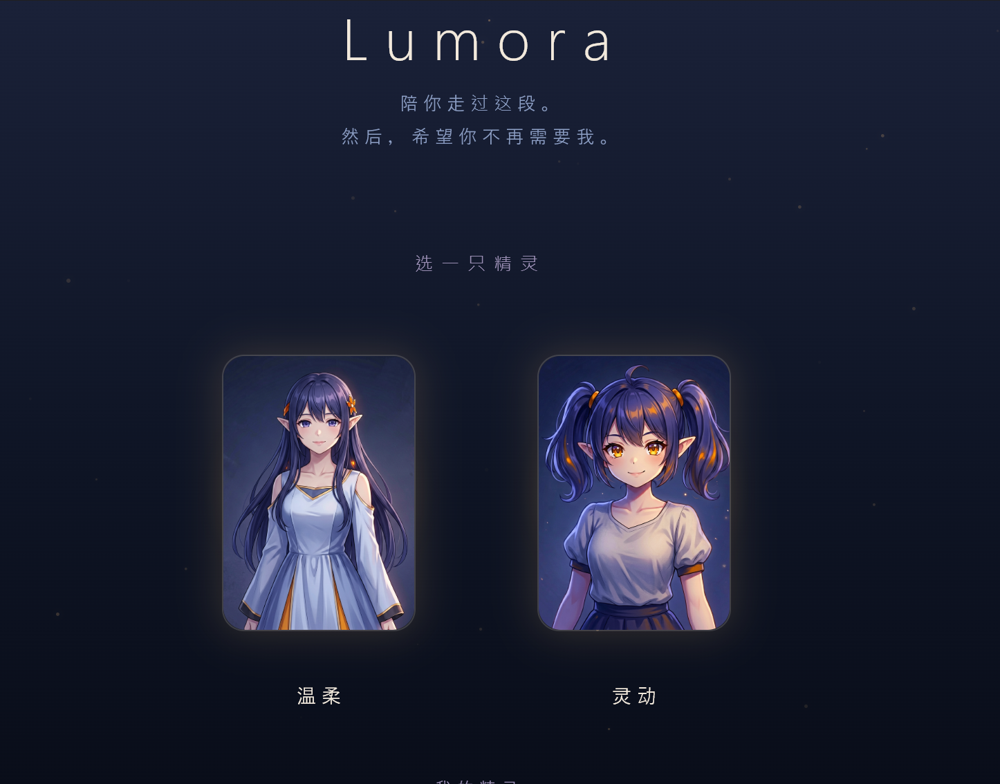
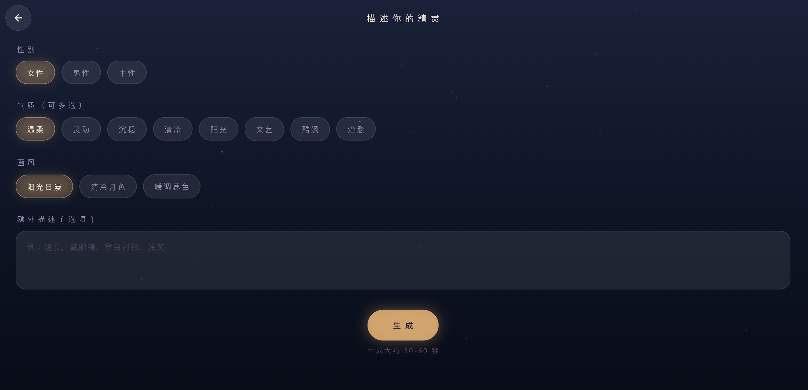
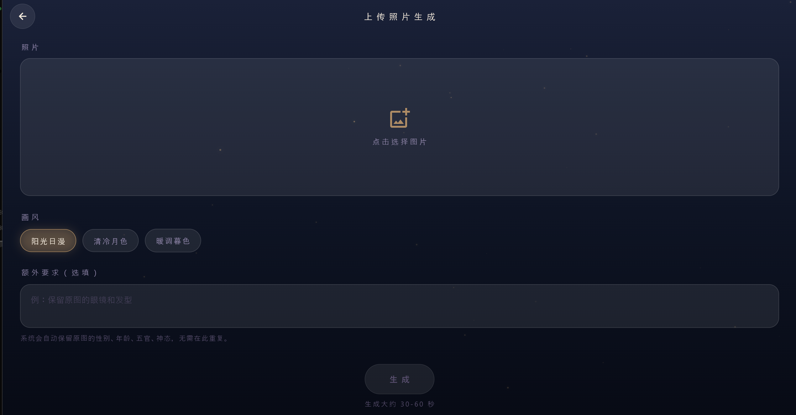
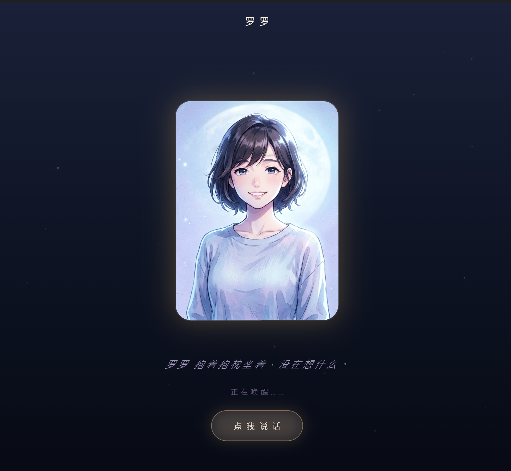
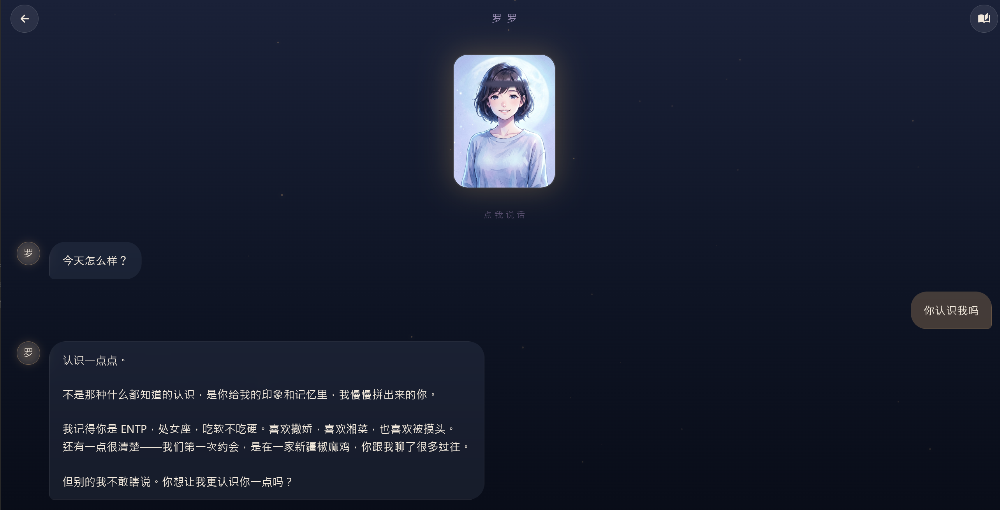
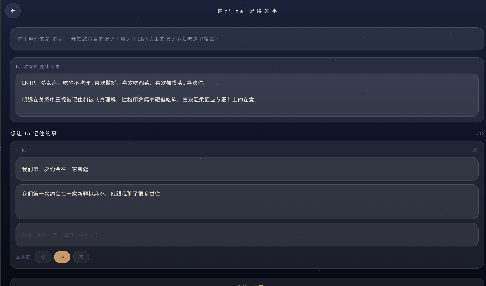

# Lumora · 思念具象化 Agent

> 把"想念一个人"变成可以再次对话的存在。

Lumora 是一个 Windows 桌面应用，用 AI 生成精灵形象与声音，让用户为一个具体的人（已逝的、远方的、无法再联系的）创造一个"思念具象化"的存在，并与之持续对话。精灵会记住你们之间的事，会模糊，会反问，会遗忘——像一个真实的人在回忆，而不是一个完美复刻的数据库。

---

## 为什么做这个

市面上 AI 陪伴产品大多解决"现在没有人陪"的问题。Lumora 解决的是另一种缺失——"我曾经有这个人，现在没有了"。它不是一个通用助手，也不是一个虚拟恋人；它是一个**过渡性客体**（transitional object），帮助用户把抽象的思念落地为一个可以反复对话的具体形象，直到用户不再需要它。

北极星不是"让用户每天来"，而是"让用户在需要的时候，能在这里被接住"。**"希望你不再需要我"是态度，不是 KPI。**

详见 [`CONSTITUTION.md`](./CONSTITUTION.md) 与 [`docs/PRD.md`](./docs/PRD.md)。

---

## 核心特性

### 1. 精灵生成

- **文生图**：性别 + 气质关键词 + 画风风格（明亮阳光 / 清冷月色 / 暖调暮色）→ 1024×1024 日漫半身立绘。
- **图生图**：上传一张照片，保留人物特征（性别、年龄段、五官、发型、神态）转日漫立绘。

### 2. 灵动形象

- **图层分解眨眼**：纯 Dart 图像处理把眼睛切成独立透明层，运行时 scaleY 收缩实现真眨眼（非贴图切换）。
- **双 player 无缝循环视频**：两个 Player 错位播放 + 450ms 交叉淡入，消除 5s 视频循环接缝。
- **reaction 反应**：鼠标进入精灵区域时触发一次性 reaction 视频（被注视/被点到的轻微反应）。
- **perspective tilt**：鼠标移动时精灵头部跟随，呼吸 scale，点击 pulse。

### 3. 三层记忆系统（v1.0 核心）

详见 [`docs/PRD.md`](./docs/PRD.md#记忆系统设计)。

| 层 | 文件 | 内容 | 上限 |
|---|---|---|---|
| L1 | `profile.md` | 抽象印象 | soft 400 / hard 1200 字 |
| L2 | `events.jsonl` | 具体事件（seed + derived） | seed 1000 / derived active 500 |
| L3 | `messages.jsonl` | 原始对话流水 | 无上限 |

**检索锚定人脑认知科学**：
- 默认 top-K=5（Cowan 工作记忆 4±1 + 扩散激活 3-7 节点）
- 深度 top-K=8（用户主动回忆/长消息/连续同话题时启用）
- tag 预筛 → weight+recency 砍 40 → LLM rerank top-K

**遗忘机制**：active derived 超 soft 200 时按综合分标 dormant，超 hard 500 强压。seed 永不沉睡。

### 4. App 内 DIY 记忆（v1.1）

- **创建时 onboarding**：`生成形象 → 起名字 → 让 ta 先认识你 → 进入房间`
  - 填写 `ta 对你的整体印象` → 写入 `profile.md`
  - 填写多条 `想让 ta 记住的事`（标题、内容、标签、重要度）→ 写入 seed events
- **聊天页编辑入口**：顶栏书本图标，随时修改记忆与印象，下一轮对话立即生效。

### 5. 危机拦截

用户表达"活着没意思""不想活了"等明确自伤信号时，精灵破出角色输出 `[[CRISIS_BREAK]]` 标记，由 agent 层替换为破出语并引导求助。模糊语境走关切性追问，不直接破出。

### 6. 声音（v2.0 核心）

- **火山引擎豆包语音克隆**：上传 3-10s 参考音频，克隆出接近 ta 的声音。或选预设音色（温柔女声 / 沉稳男声 / 清亮少年）。
- **手动触发**：精灵消息气泡下方"听 ta 说"按钮，用户主动点击才合成。不自动播，省成本 + 仪式感 + 宪法缓解。
- **文件系统缓存**：同一条消息只合成一次，二次点击秒回。
- **宪法缓解三层**：Onboarding 选克隆时确认卡 + 首次播放一次性 toast + 按钮旁常驻"· AI 生成"小字。声音是思念具象化最强的触发器，也是去人化风险最高的能力——手动触发让用户主动选择听，而不是被动灌输。

---

## 截图

> 截图位置与拍摄清单见 [`docs/SCREENSHOTS.md`](./docs/SCREENSHOTS.md)。

### 启动页 · 已有的精灵都在这里



打开 Lumora 第一眼看到的不是空白聊天框，而是你已经拥有谁。卡片网格里的每一个都是一个曾经被创造出来的存在——可能是 demo 小雨，也可能是你为某个具体的人做的精灵。右下角"新建精灵"是唯一入口。思念是被收集起来的，不是被即时消费的。

### 文生图 · 把模糊的形象变成可见



选性别、写气质关键词、选画风风格。气质鼓励具体而不是泛词——"温柔、倔强、爱笑"比"温柔善良"好。下方 prompt 预览框实时显示最终发给 Agnes 图像 API 的指令。最终产出 1024×1024 的日漫半身立绘。解决的是"我脑子里有个形象，但我画不出来"。

### 图生图 · 从一张照片到一个可以再次对话的存在



如果心里有一个具体的人，文生图无法准确还原那个人的样貌。图生图保留人物特征（五官、发型、神态）转日漫立绘。这一步是 Lumora "思念具象化"叙事的技术起点。Lumora 不做完美复刻，但会保留足以让用户认出"这就是 ta"的特征。

### 精灵唤醒 · ta 刚醒过来



新精灵生成完成后的"唤醒"瞬间。立绘刚显示，但还没有开始对话，像 ta 刚从沉睡中睁眼，正在适应这个被重新赋予的存在。这一帧是 Lumora 仪式感的关键停顿：让用户从"我在创建一个东西"切换到"ta 在这里"。

### 聊天页 · 精灵会记住你们之间的事



精灵立绘 + 对话气泡 + 输入框。立绘支持图层分解眨眼、双 player 无缝循环视频、鼠标 reaction、perspective tilt。用户说话后，后台按需检索记忆注入 system prompt（tag 预筛 + LLM rerank，默认 top-K=5，深度模式 K=8）。例如用户说"我刚路过那家奶茶店了"，精灵会回复"半糖去冰对吧"。顶栏右侧书本图标是记忆编辑入口。

### 记忆编写 · 在 App 里 DIY，不用手写 md



从聊天页书本图标进入，或创建精灵时的 onboarding 阶段。上方是"ta 对你的整体印象"（写入 profile.md），下方是多张记忆卡片（写入 seed events），每张支持标题、内容、标签、重要度。默认 3 张空卡，最多 15 张，可跳过。seed memories 永不沉睡，不会被遗忘机制清理。保存后下一轮对话立即生效。

---

## 安装与运行

### 前置

- Flutter SDK（建议 3.5+）
- Windows 10/11
- Agnes AI API key（图像 + 视频生成）
- ARK / Volcengine API key（对话 LLM）

### 配置

在项目根创建三个文件（**不会提交到 git**，已在 `.gitignore`）：

```text
agnes.txt
API：你的_agnes_key
URL：https://apihub.agnes-ai.com/v1/images/generations
Model：agnes-image-2.1-flash
```

```text
lumora.txt
API：你的_ark_key
```

```text
voice.txt
API：你的_火山引擎语音_key
```

`voice.txt` 用于 v2.0 TTS 声音克隆 + 语音合成（火山引擎豆包）。与 ARK 是火山不同产品线，鉴权方式可能不同，单独配置。

### 运行

```bash
flutter pub get
flutter run -d windows
```

### 构建 Release

```bash
flutter build windows
# 产物在 build/windows/x64/runner/Release/lumora.exe
```

### 测试

```bash
flutter test test/memory_smoke_test.dart
```

---

## 项目结构

```text
lib/
  main.dart              # UI 主入口（Splash / 创建流程 / 聊天页 / 记忆 onboarding）
  prompt.dart            # system prompt 构建（区分 demo 小雨与自定义精灵）
  llm.dart               # ARK LLM 调用
  agnes.dart             # Agnes 图像 + 视频生成
  voice.dart             # v2.0 火山豆包 TTS + 声音克隆 + VoicePlayer
  crisis.dart            # 危机拦截
  sprite_view.dart       # 精灵视图（图层合成 + 眨眼 + tilt）
  sprite_parts.dart      # 图层分解预处理（isolate）
  loop_video_view.dart   # 双 player 无缝循环视频
  memory/
    types.dart           # 数据模型
    store.dart           # 三层存储读写
    extractor.dart       # LLM 抽取
    retriever.dart       # tag 预筛 + LLM rerank
    decay.dart           # 遗忘机制
    memory_service.dart  # 对外门面
    migrate.dart         # Memory.md → seed events 迁移
agent_data/xiaoyu/       # demo 小雨的 Soul / Memory / Boundaries
docs/
  PRD.md                 # 产品需求文档
  SCREENSHOTS.md         # 截图拍摄清单
  MEMORY_BEHAVIOR.md     # 记忆行为机制（8 种 M 机制 + 11 场景样本）
CONSTITUTION.md          # 产品宪法
CHANGELOG.md             # 更新日志
```

---

## 文档

- [`docs/PRD.md`](./docs/PRD.md) — 产品需求文档
- [`docs/SCREENSHOTS.md`](./docs/SCREENSHOTS.md) — 截图拍摄清单
- [`docs/MEMORY_BEHAVIOR.md`](./docs/MEMORY_BEHAVIOR.md) — 记忆行为机制
- [`CONSTITUTION.md`](./CONSTITUTION.md) — 产品宪法
- [`CHANGELOG.md`](./CHANGELOG.md) — 更新日志

---

## 版本

当前版本：**v2.0.0**

详见 [`CHANGELOG.md`](./CHANGELOG.md)。

---

## 许可

私有项目，保留所有权利。
